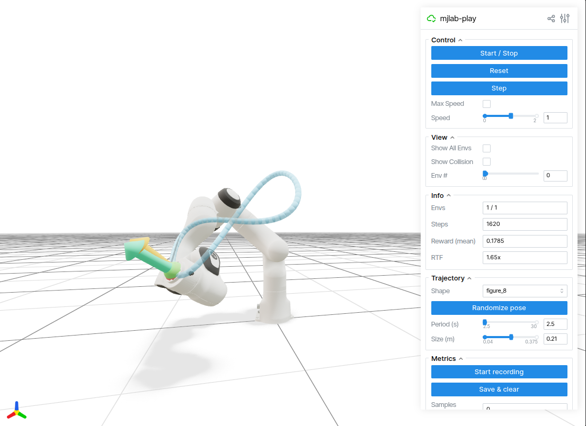

# mjlab_franka — Franka trajectory tracking with mjlab + viser

Train a Franka Panda arm to track parametric end-effector trajectories
(line, circle, square, figure-8, sinusoid) sampled in randomly-oriented planes
within the arm's reachable workspace. Built on:

- **[mjlab 1.3.0](https://pypi.org/project/mjlab/)** — Isaac-Lab-style RL framework on MuJoCo Warp.
- **[skrl](https://skrl.readthedocs.io/)** — PPO (asymmetric actor-critic).
- **[viser](https://viser.studio/)** — browser-based 3D viewer (live training + post-training playback).
- **[Hydra](https://hydra.cc/)** — structured config & CLI overrides.

The Franka asset is **not** in mjlab's bundled asset zoo (only G1/Go1/YAM ship);
we fetch it from MuJoCo Menagerie via a small script.

## Setup

```bash
# 1. Install dependencies (cu128 torch wheel + warp 1.12.x).
uv sync

# 2. Fetch Franka XML + meshes from MuJoCo Menagerie.
uv run python scripts/fetch_franka.py
```

> **Note** — `PYTORCH_JIT=0` is set automatically by `mjlab_franka._compat`,
> which is the first import in both `train.py` and `play.py`. You only need
> to set it manually if you invoke `python -c "import mjlab"` directly
> without going through the project entry points. This works around a
> `torch.jit.script` segfault in `mjlab/utils/lab_api/math.py:matrix_from_quat`.

## Train

```bash
# Full training (4096 envs, 30k timesteps, viser at http://localhost:8080):
uv run train experiment=franka_trajectory_track_ppo

# Quick smoke test:
uv run train experiment=franka_trajectory_track_ppo \
    env.num_envs=64 algo.timesteps=200 visualize=false

# Common overrides:
uv run train experiment=franka_trajectory_track_ppo \
    env.num_envs=2048 \
    algo.learning_rate=5e-4 \
    algo.timesteps=50000
```

Checkpoints go to `~/.cache/mjlab_franka/runs/<experiment>/checkpoints/`.

## Visualize / playback

```bash
# Visualize the task with a random action policy (no checkpoint needed):
uv run play --task franka_trajectory_track_spline --agent random

# Replay a trained policy:
uv run play --task franka_trajectory_track_spline --agent trained \
    --checkpoint ~/.cache/mjlab_franka/runs/franka_trajectory_track_ppo/checkpoints/agent_30000.pt
```

The viser server listens on **http://localhost:8080**. Open in any browser to
see the Franka, the sampled trajectory polyline (cylinders), and a sphere at
the current trajectory target.

### Interactive playback



`play-interactive` (note the **hyphen** — the entry point is `play-interactive`,
not `play_interactive`) launches a trained policy with extra GUI controls in
viser: shape selection, pose randomization, period/size sliders, and metric
recording + plotting. It defaults to the bundled checkpoint at
[checkpoints/policy.pt](checkpoints/policy.pt).

```bash
# Default: spline task, bundled checkpoint.
uv run play-interactive

# Use a custom local checkpoint:
uv run play-interactive --checkpoint /path/to/agent.pt

# Or pull from a wandb run (same syntax as `play`):
uv run play-interactive --checkpoint <entity>/<project>/<run_id> \
    --wandb-filename best
```

The only task currently registered is `franka_trajectory_track_spline`.

## Project layout

```
src/mjlab_franka/
├── _compat.py                       # sets PYTORCH_JIT=0
├── algos/
│   ├── ppo_skrl.py                  # skrl PPO entry point + Gaussian/Det networks
│   └── registry.py
├── config/
│   ├── base.py                      # TrainConfig / EnvConfig / TrackerConfig
│   └── experiments/
│       └── franka_trajectory_track_ppo.py
├── core/
│   ├── training_visualizer.py       # background viser scene for live training
│   ├── visualizer.py                # base viser PlayApp
│   └── interactive_play.py          # extends PlayApp with GUI controls + metrics
├── envs/
│   ├── factory.py                   # make_env(task, num_envs, ...)
│   └── viewer_wrapper.py            # adds get_observations() for the viewer
├── robots/franka/
│   ├── franka_constants.py          # EntityCfg + 7 BuiltinPositionActuatorCfg
│   └── xmls/                        # panda_nohand.xml + meshes (fetched)
├── tasks/
│   ├── registry.py                  # @register_task decorator
│   └── reaching/
│       ├── franka_reaching_spline.py    # task config factory
│       └── mdp/                         # commands / observations / rewards / actions
├── train.py
├── play.py
└── play_interactive.py
```

## Trajectory shapes

Per-episode, each parallel env independently samples:

- **shape** ∈ {`line`, `circle`, `square`, `figure_8`, `sinusoid`}
- **plane center** in a reachable cuboid (x ∈ [0.35, 0.6], y ∈ [-0.25, 0.25], z ∈ [0.25, 0.6])
- **plane orientation**: uniformly random `SO(3)` via QR-decomposition
- **size** ∈ [0.08, 0.18] m
- **period** ∈ [4, 10] s

The command tensor is `[target_pos_w (3), target_vel_w (3)]` per env.

## Design decisions

### Trajectory representation

Each trajectory lives in a randomly-oriented 2D plane embedded in 3D space.
The plane orientation is drawn from a **uniform SO(3)** distribution (QR decomposition of a Gaussian matrix), with the plane normal flipped if it points away from the robot base, so the trajectory always faces the arm.
The 5 shapes (line, circle, square, figure-8, sinusoid) are all defined as closed parametric curves, so tracking speed and path length are both controlled by `period` and `size`.

At every physics step the command term exposes a **6D vector** — `[target_pos_w (3), target_vel_w (3)]` — giving the policy both where the target is and how fast it is moving. Providing the analytic velocity directly removes the need for the policy to internally differentiate the position signal, which would require history or recurrent state.

### Observations (actor — 30D)

| Term | Dim | Noise |
|---|---|---|
| `joint_pos_rel` | 7 | ±0.01 rad uniform |
| `joint_vel_rel` | 7 | ±0.5 rad/s uniform |
| `ee_target_offset_w` | 3 | — |
| `ee_target_velocity_w` | 3 | — |
| `trajectory_plane_normal_w` | 3 | — |
| `last_action` | 7 | — |

The critic additionally observes `ee_vel` (3) and `ee_z_axis` (3) — privileged signals not available at deployment (**asymmetric actor-critic**). The extra critic information makes value estimates more accurate during training without requiring the deployed policy to observe them.

`last_action` closes the loop on what the actuator last sent, giving the policy temporal context for smooth output without needing recurrence.

### Noise and domain randomisation

Four sources of perturbation are applied during training; all are disabled at play time except (4):

1. **Per-step observation noise** — `joint_pos_rel` ±0.01 rad, `joint_vel_rel` ±0.5 rad/s (realistic encoder / tachometer noise).
2. **Encoder bias** (startup event) — a persistent per-joint offset sampled from ±0.015 rad at the start of each episode, simulating calibration error.
3. **Random joint reset** — episode start positions ±0.5 rad from default, velocities ±0.5 rad/s, so the policy never sees the same initial state.
4. **Partially unreachable configurations** — random plane orientations and large sizes push portions of the trajectory outside the arm's reachable workspace. The policy must track as closely as kinematics allow; no special handling is added, so robustness emerges from training diversity alone.

### Action design — quintic spline

The policy outputs 7-DOF joint **position increments** Δq (scaled by 0.1 rad/step).
`QuinticSplineJointPositionAction` then fits a **5th-order polynomial** with boundary conditions on position, velocity, *and* acceleration at both the start and end of the 20 ms control cycle, and evaluates it at each of the 4 physics sub-steps (5 ms each).

This means the commanded joint trajectory is C² continuous across control cycle boundaries — position, velocity, and acceleration are all continuous — without any explicit smoothness reward. Step-change jitter at the actuator is structurally impossible.

### Reward design

| Term | Weight | Shape | Purpose |
|---|---|---|---|
| `track_ee_pos` | 5.0 | exp(−‖err‖²/0.05²) | Tight position tracking (σ = 5 cm) |
| `track_ee_pos_coarse` | 1.0 | exp(−‖err‖²/0.20²) | Wide basin of attraction during early training |
| `track_ee_vel` | 0.5 | exp(−‖vel_err‖²/0.50²) | Velocity tracking — incentivises keeping up with the target |
| `ee_plane_perpendicular` | 1.0 | exp(−((1−n̂·ẑ_ee)/0.1)²) | EE z-axis aligned with plane normal (implicit orientation control) |
| `wrist_position` | 2.0 | exp(−‖wrist_err‖²/0.05²) | Keeps wrist directly behind the EE along the plane normal — stable, singularity-avoiding posture |

The dual position reward (`track_ee_pos` + `track_ee_pos_coarse`) provides a dense gradient at distance and a tight reward near the target. `ee_plane_perpendicular` avoids specifying a full 6D target pose; it only constrains the approach axis, leaving the policy free to choose wrist roll.

### Evaluation

Run the interactive play app, start recording, let the policy run for at least one full trajectory period, then **Save & clear**:

```bash
uv run play-interactive
# In the viser GUI: Start recording → Save & clear
```

The output folder (`play_logs/<session>/save_NNN/`) contains:

| File | Contents |
|---|---|
| `metrics.csv` | Per-step timeseries: `ee_pos_error`, `ee_speed_w`, `joint_vel_l2`, `joint_acc_l2`, `joint_jerk_l2`, `action_rate_l2` |
| `metrics.png` | 6-panel plot of the above |
| `summary.json` | Mean / std / max per metric + trajectory metadata (`shape`, `period`, `size`) |

Primary tracking metric: **mean EE L2 error** (m) from `summary.json → ee_pos_error.mean`.
Smoothness metric: `joint_jerk_l2.mean` (lower is smoother; reflects inter-cycle policy consistency).

## Results

Measured with the bundled checkpoint (`checkpoints/policy.pt`) using `play-interactive` — one recording per shape, each covering at least one full trajectory period (~11–12 s), size ≈ 0.13–0.18 m.

| Shape | EE pos error (mm) ↓ | Joint jerk L2 (rad/s³) ↓ |
|---|---|---|
| line | 6.7 ± 0.4 | 8 640 ± 845 |
| circle | 7.0 ± 1.0 | 8 248 ± 1 082 |
| square | 2.2 ± 1.0 | 10 276 ± 1 635 |
| figure_8 | 2.1 ± 0.7 | 10 237 ± 1 938 |
| sinusoid | 2.4 ± 0.9 | 10 874 ± 1 077 |

**EE position error** — Euclidean distance between the EE and the current trajectory target, averaged over the recording. The Franka's mechanical position repeatability is <±0.1 mm (hardware spec); the gap to that floor is policy error, not hardware error. RL policies trained purely in simulation typically achieve 5–20 mm on continuous tracking tasks; sub-10 mm is competitive, and the 2–3 mm seen on the more complex shapes (square, figure-8, sinusoid) is on par with model-based controllers that require an explicit dynamics model.

**Joint jerk L2** — L2 norm of the 7-joint jerk vector (finite-difference of acceleration at 50 Hz, units rad/s³). The Franka FCI enforces hard per-joint jerk limits: 5000 rad/s³ uniformly for the FR3, and 3750–10000 rad/s³ per joint for the FER/Panda ([source](https://frankarobotics.github.io/docs/robot_specifications.html)). Dividing our L2 norm by √7 gives a rough mean per-joint figure of ~3100–4100 rad/s³ — within the per-joint limits for both robot variants. The quintic spline action parameterisation guarantees C² continuity within each 20 ms control cycle; the inter-cycle jerk visible here reflects the policy switching between cycles and is shaped by the reward, not the action parameterisation.

The higher jerk for square, figure-8, and sinusoid reflects their sharper curvature and direction reversals; the lower EE error on those shapes is because those recordings used smaller, slower trajectories relative to the arm's dynamic range.

## Known issues

- **torch.jit.script segfault**: workaround via `PYTORCH_JIT=0` (set in `_compat.py`).
- **warp-lang ≥ 1.13** removed `wp.context.runtime` → pinned `warp-lang>=1.12,<1.13`.
- Live training visualizer is a single-camera snapshot at ~30 Hz; no checkpoint scrubbing UI (use `play` on a saved checkpoint for that).

## Development

Formatting and linting are enforced by [ruff](https://docs.astral.sh/ruff/) via a
[pre-commit](https://pre-commit.com/) hook. After cloning:

```bash
uv sync                       # pulls pre-commit into the dev group
uv run pre-commit install     # registers .git/hooks/pre-commit
```

The hook runs `ruff` (lint with `--fix`) and `ruff-format` on every staged
file. To check the whole repo at once:

```bash
uv run pre-commit run --all-files
```

Tests live under `tests/` and run with `pytest`:

```bash
uv run pytest -q
```

## Logging with WandB (personal account, project-local)

> **Privacy** — your wandb API key, personal git identity, and any SSH key paths
> stay **local to this repo / machine** and are never pushed to GitHub. See
> [Privacy & secrets](#privacy--secrets) below for what is gitignored and what
> is not.

The training loop logs episode rewards, raw reward outputs (via the
`MetricsManager`), user-defined metric terms (e.g. `Metrics / ee_traj_distance_m`),
PPO loss stats, and uploads every checkpoint (`model_*.pt`, `best_agent.pt`)
to the active wandb run as soon as it is written.

To use a **personal** wandb account on this machine without touching the
existing global login, write the credentials to a project-local `.env`
(gitignored) at the repo root:

```bash
# Get a key from https://wandb.ai/authorize
cat > .env <<'EOF'
WANDB_API_KEY=xxxxxxxxxxxxxxxxxxxxxxxxxxxxxxxxxxxxxxxx
WANDB_ENTITY=your-personal-username
EOF
```

`mjlab_franka._envfile` is imported from `_compat.py` and loads `.env` into
`os.environ` before any `import wandb`, so the global `~/.netrc` is left alone.

Enable wandb in the experiment / on the CLI:

```bash
uv run train experiment=franka_trajectory_track_ppo \
    tracker.wandb.project=mjlab_franka \
    tracker.checkpoint.save_interval=2000

# Disable wandb explicitly:
uv run train experiment=franka_trajectory_track_ppo tracker.wandb=null
```

### Resume from a wandb run

```bash
# Resume training, pulling the latest model_*.pt from the run:
uv run train experiment=franka_trajectory_track_ppo \
    resume=<entity>/<project>/<run_id> wandb_filename=latest

# Warm-start network weights only (no optimizer / step counter):
uv run train experiment=franka_trajectory_track_ppo \
    init_from=<entity>/<project>/<run_id> wandb_filename=best_agent.pt
```

### Play from a wandb checkpoint

```bash
uv run play --task franka_trajectory_track --agent trained \
    --checkpoint <entity>/<project>/<run_id> --wandb-filename best
```

Wandb files are cached under `~/.cache/mjlab_franka/checkpoints/<run_id>/`.

## Per-repo personal git identity

To use a **personal** git identity for this repo without touching your global
`~/.gitconfig`, run the helper script once:

```bash
scripts/setup_personal_git.sh "Your Name" you@personal.example ~/.ssh/id_ed25519_personal
```

This writes `user.name`, `user.email`, and `core.sshCommand` via
`git config --local`, so only this repo uses the personal identity / key.

Alternative — add a Host alias in `~/.ssh/config` and use it in the remote URL:

```sshconfig
# ~/.ssh/config
Host github-personal
    HostName github.com
    User git
    IdentityFile ~/.ssh/id_ed25519_personal
    IdentitiesOnly yes
```

```bash
git remote set-url origin git@github-personal:<user>/<repo>.git
```

`git config --local` writes to `.git/config`, which is **inside `.git/` and
therefore never tracked by git** — your personal name, email, and SSH key path
cannot be pushed to GitHub by accident.

## Privacy & secrets

This repo is set up so that nothing personal leaks to GitHub. What stays
strictly local:

| What | Where it lives | Why it can't be pushed |
| --- | --- | --- |
| Wandb API key, entity | `.env` (project root) | Listed in `.gitignore` (`.env`, `.env.*`, `.netrc`) |
| Per-repo git identity | `.git/config` | The whole `.git/` directory is never tracked by git |
| Per-repo SSH key path | `.git/config` (via `core.sshCommand`) | Same as above |
| SSH private keys | `~/.ssh/...` (outside the repo) | Not inside the repo; also gitignored if dropped here |
| Wandb run dirs / cached checkpoints | `wandb/`, `~/.cache/mjlab_franka/` | `wandb/` and `.cache/` are gitignored |

### Quick checks before you push

```bash
# 1. Confirm .env is ignored (should print "::: .env").
git check-ignore -v .env

# 2. Confirm no secrets are staged.
git diff --cached | grep -iE 'WANDB_API_KEY|api_key|password|BEGIN .* PRIVATE KEY' && \
    echo "!! secret-looking string is staged !!" || echo "OK"

# 3. Inspect the per-repo git config (never tracked, just for your eyes).
git config --local --list | grep -E 'user\.|core\.sshCommand'

# 4. Confirm the remote uses the right host alias.
git remote -v
```

### Setting up secrets (one-time, per clone)

```bash
# Wandb: get your key from https://wandb.ai/authorize
cp .env.example .env
$EDITOR .env            # fill in WANDB_API_KEY + WANDB_ENTITY

# Git identity + SSH key (writes to .git/config only):
scripts/setup_personal_git.sh "Your Name" you@personal.example ~/.ssh/id_ed25519_personal
```

If you accidentally commit `.env` or a key, **rotate the credential immediately**
(re-issue the wandb key at https://wandb.ai/authorize, regenerate the SSH key)
and rewrite history with `git filter-repo` before pushing.
